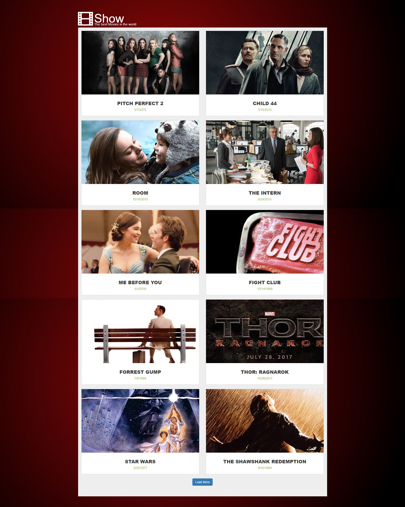

# Movies site

## Features
- List of latest movies with release date
- Detailed information, poster and overview about movie in movie details page
- Cast information with list of people and characters they acted
- Ability to add comments to movies
- Comments section in movie details page with list of comments added

## How to setup local environment

### Prerequisites
- Install NodeJS and NPM
- Install MongoDB
- Clone the repository `git clone https://github.com/jurgisrudaks/show-cinema.git`
- CD to project root and run `npm install`
- CD to `api` folder and run `npm install`
- Run mongoDB server with `mongod --dbpath ./api/db`
- Run `mongorestore --db cinema ./dump/cinema` to import database structure and dummy data

### Development
- Run `npm run start:dev` to start the app
- Run `npm run start:api` to start api server
- Visit the site on `localhost:3000`

### Production
- Run `npm run start:prod` to start the app
- Run `npm run start-api` to start api server
- Visit the site on `localhost:3000`

## Technologies used
- Redux state container
- React.js UI components
- MongoDB for data storage
- Bootstrap for base styles and grid
- SASS for more effective styles defining
- Express servers for static content and api
- Webpack UglifyJS plugin for smaller bundle size
- HMR (Hot Module Replacement) for faster development
- ESLint linter for identifying and reporting JS problems/patterns

## Credits
Jurgis Rudaks